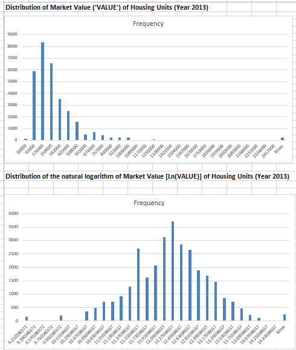

# **Housing Values Analysis with Hypothesis Testing (2005-2013)**

## **Table of Contents**

1. **[Business Problem Overview](#1-business-problem-overview)**  
   - **[1.1 Objective](#11-objective)**  
   - **[1.2 Problem Statement](#12-problem-statement)**
2. **[Data Collection and Preprocessing](#3-data-collection-and-preprocessing)**  
   - **[2.1 Data Sources](#21-data-sources)**  
   - **[2.2 Columns Definition](#22-columns-definition)**  
   - **[2.3 Data Cleaning](#23-data-cleaning)**  
   - **[2.4 Data Integration](#24-data-integration)**  

3. **[Methodology](#3-methodology)**  
   - **[3.1 Hypothesis Testing for Market Value Differences](#31-hypothesis-testing-for-market-value-differences-methodology)**  
        - **[3.1.1. Market values differences between occupied and vacant housing units](#311-market-values-differences-between-occupied-and-vacant-housing-units)**    
        - **[3.1.2 Market values differences between fair market rent (FMK)](#312-market-values-differences-between-fair-market-rent-fmk)**   
         
   - **[3.2 Regression Analysis for Current Housing Market Values for Single Family Units for Year 2013](#32-regression-analysis-for-current-housing-market-values-for-single-family-units-for-year-2013)**
   - **[3.3 Future Market Value Forecasting](#33-future-market-value-forecasting)** 

4. **[Conclusion and Recommendations](#4-conclusion-and-recommedations)**
   - **[4.1 Key Findings](#41-key-findings)** 
   - **[4.2 Policy Implications](#42-policy-implications)**
   - **[4.3 Recommendations for Stakeholders](#43-recommendations-for-stakeholders)**

---

## 1. Business Problem Overview

### 1.1 Objective

The objective of this project is to analyze trends in the U.S. housing market from 2005 to 2013, focusing on identifying the key factors that influence housing values during this period. The analysis aims to uncover variables such as occupancy status, fair market rents, and other economic factors that impact housing market prices. The primary tool for this analysis is `Excel`, where data will be cleaned, manipulated, and examined using various statistical methods. 
A regression model will then be developed using selected independent variables to predict housing market prices for 2013. The model will be extended to include additional independent variables from 2011 and dependent variable from 2013 to forecast housing prices for the following year. The model's performance will be evaluated using R-squared to assess its accuracy, and further refinement and development will be conducted to improve its predictive power over time.  

### 1.2 Problem Statement

- Analyze the differences in housing market values between occupied and vacant housing units across five years.
- Perform a paired t-test comparison to examine how market rents (`FMK` variable) have varied over the past five years.
- Train a regression model to predict the housing market values for the year 2013.
- Develop a separate model to forecast housing market values for the following year.

## 2. Data Collection and Preprocessing

### 2.1 Data Sources

The data used in this analysis is collected from the **Housing Affordability Data System** (HADS) provided by HUD. The dataset contains housing-level variables collected across multiple years (2005, 2007, 2009, 2011, and 2013) from the **Housing Affordability Data System** (HADS).  

Link dataset: [US Housing values data](https://www.huduser.gov/portal/datasets/hads/hads.html)

### 2.2 Columns Definition
  
Utilizing the total of 27 variables for this analysis, the detailed columns definition as below  

| **Variable Name** | **Type** | **Explanation** |
|-------------------|----------|-----------------|
| **CONTROL** | Character String | A control variable for Housing Unit. Useful to match data across datasets from different years. |
| **AGE1** | Numerical | Age of head of household. |
| **METRO3** | Character (‘1’, ‘2’, ‘3’, ‘4’, or ‘5’) | Metropolitan status: <br> ‘1’ : Central City <br> ‘2’, ‘3’, ‘4’, ‘5’ : Others. |
| **REGION** | Character (‘1’, ‘2’, ‘3’, or ‘4’) | The four census regions—Northeast, Midwest, South, and West. |
| **LMED** | Numerical ($) | Area Median Income. |
| **FMR** | Numerical ($) | Fair Market Monthly Rent. |
| **IPOV** | Numerical ($) | Poverty Income threshold. |
| **BEDRMS** | Numerical | Number of Bedrooms in the unit. |
| **BUILT** | Numerical | Year the unit was built. |
| **STATUS** | Character (‘1’, ‘3’) | Occupied or Vacant. |
| **TYPE** | Numerical | Structure Type: <br> 1 - House, apartment, flat <br> 2 - Mobile home with no permanent room added <br> 3 - Mobile home with permanent room added <br> 4 - HU, in nontransient hotel, motel, etc <br> 5 - HU, in permanent transient hotel, motel, etc <br> 6 - HU, in rooming house <br> 7 - Boat or recreation vehicle <br> 9 - HU, not specified above. |
| **VALUE** | Numerical ($) | Current market value of unit. |
| **NUNITS** | Numerical | Number of Units in Building. |
| **ROOMS** | Numerical | Number of rooms in the unit. |
| **PER** | Numerical | Number of persons in Household. |
| **ZINC2** | Numerical ($) | Annual Household income. |
| **ZADEQ** | Character | Adequacy of unit: <br> ‘1’ - Adequate <br> ‘2’ - Moderately Inadequate <br> ‘3’ - Severely Inadequate <br> ‘-6’ - Vacant - No information. |
| **ZSMHC** | Numerical ($) | Monthly housing costs. For renters, housing cost is contract rent plus utility costs. For Owners, mortgage is not included. |
| **STRUCTURETYPE** | Numerical | Structure Type: <br> 1 - Single Family <br> 2 - 2-4 units <br> 3 - 5-19 units <br> 4 - 20-49 units <br> 5 - 50+ units <br> 6 - Mobile Home <br> -9 - Not Known. |
| **OWNRENT** | Character (‘1’, ‘2’) | ‘1’ - Owner: Owner occupied, vacant for sale, and sold but not occupied. <br> ‘2’ - Rental: Occupied units rented for cash and without payment of cash rent. Vacant for rent, vacant for rent or sale, and rented but not occupied. |
| **UTILITY** | Numerical ($) | Monthly utilities cost (gas, oil, electricity, other fuel, trash collection, and water). |
| **OTHERCOST** | Numerical ($) | Sum of ‘other monthly costs’ such as Home owners’ or renters’ insurance, Land rent (where distinct from unit rent), Condominium fees (where applicable), Other mobile home fees (where applicable). |
| **COST06** | Numerical ($) | Monthly mortgage payments assuming 6% interest. This applies only to “Owners”. |
| **COST08** | Numerical ($) | Monthly mortgage payments assuming 8% interest. This applies only to “Owners”. |
| **COST12** | Numerical ($) | Monthly mortgage payments assuming 12% interest. This applies only to “Owners”. |
| **COSTMED** | Numerical ($) | Monthly mortgage payments assuming median interest. This applies only to “Owners”. |
| **ASSISTED** | Numerical | Did the housing unit receive some governmental ‘assistance’? <br> 0 - Not assisted <br> 1 - Assisted <br> -9 - Not Known. |


### 2.3 Data Cleaning
- Data Errors: Remove entries with values suspected to be erroneous, specifically those below $1,000 USD.
- Housing units entries for the year 2005, 2007, 2009, 2011 and 2013 after deleting suspicous entries are 30514,27785, 31317, 85050 and 36675 respectively.   

### 2.4 Data Integration  

**Power Query** was used to import and transform five CSV files. Unnecessary columns were removed, leaving 27 relevant columns for analysis. Values under $1000 were filtered and cleaned. The cleaned data was then merged into a single workbook for further analysis.  

---

## 3. Methodology

### 3.1 Hypothesis Testing for Market Value Differences

#### 3.1.1 Market values differences between occupied and vacant housing units
Data pre-processing: Using column `STATUS` which display the occupied('1') and vacant status ('3')
Analysis steps:  
- Create a pivot table each year which column is the variable `STATUS` and row is the variable `CONTROL` (unique housing id) and value is the variable `VALUE` of the housing units.  
- Then I used Data Analysis Tool to perform the hypothesis test for this analysis.

The hypothesis test used in this analysis is a **Two-Sample t-Test Assuming Equal Variances (Two-Tailed)**:

- ___Null hypothesis: H0: µOccupied - µNot-Occupied =  0___
- ___Alternative hpothesis: HA: µOccupied - µNot-Occupied ≠  0___

Firstly, I perform Descriptive Statistical Analysis on five sheets for Occupied and Vacant Housing Units.
Secondly, I performed the two sample equal t-test for each year.

__Housing Occupancy and Vacancy Data Across Years__  

| Year | Occupied Housing | Vacant Housing |
|------|------------------|----------------|
| 2005 | 29,440           | 1,074          |
| 2007 | 26,466           | 1,319          |
| 2009 | 30,081           | 1,236          |
| 2011 | 82,078           | 2,972          |
| 2013 | 35,418           | 1,257          |


__The sample output for year 2005 as below__  

| **Statistic**         | **Value**             |
|-----------------------|-----------------------|
| **Hypothesized Mean Difference** | 0 |
| **Pooled Variance**   | 77,825,842,531        |
| **Degrees of Freedom (df)** | 23,143              |
| **t Stat**            | 0.77                  |
| **t Critical (one-tail)** | 1.645             |
| **t Critical (two-tail)** | 1.960             |
| **P(T<=t) one-tail**  | 0.221                 |
| **P(T<=t) two-tail**  | 0.443                 |

**Result:**  

- After performing hypothesis testing for all five years, the null hypothesis could not be rejected in any case. For example, in 2005, the t-statistic was 0.77, which falls between the critical values of -1.96 and 1.96 (the t-cutoff). Since the t-statistic does not fall into the rejection region, this indicates that there is insufficient evidence to conclude that there is a significant difference between the values for occupied housing units and vacant housing units in the US. This pattern was consistent across all five years, suggesting that the values for occupied housing units were generally greater than those for vacant housing units during the observed period.  

#### 3.1.2 Market values differences between fair market rent (FMK)

- I used the unique CONTROL variable, which represents the housing ID, and applied the VLOOKUP function to retrieve the corresponding FMK values from the years 2005 to 2013. Afterward, I removed any records where the FMK value was missing in any of those years.
- Sample formula:  
```
=VLOOKUP($A2, thads2005!$A:$G, 7, FALSE)
```  
This formula combines the FMK values for each year using VLOOKUP, where `$A2` refers to the row identifier for each year, and `thads2005!$A:$G` is the data range in the 2005 sheet.  

Displaying the top 10 rows of the combined and cleaned dataset for FMK:  

| FMR_2005 | FMR_2007 | FMR_2009 | FMR_2011 | FMR_2013 |
|----------|----------|----------|----------|----------|
| 519      | 616      | 685      | 711      | 737      |
| 600      | 605      | 670      | 673      | 657      |
| 788      | 807      | 897      | 935      | 988      |
| 702      | 778      | 743      | 796      | 773      |
| 546      | 599      | 503      | 531      | 552      |
| 680      | 757      | 861      | 895      | 949      |
| 1081     | 956      | 1037     | 1107     | 1239     |
| 1006     | 1097     | 1156     | 1235     | 1277     |
| 916      | 900      | 890      | 923      | 993      |
| 862      | 930      | 973      | 752      | 794      |


__Descriptive Statistic of FMK values for 5 years__ 

| **Statistic**       | **2005**   | **2007**   | **2009**   | **2011**   | **2013**   |
|---------------------|------------|------------|------------|------------|------------|
| **Mean**            | 929.04     | 977.77     | 1063.87    | 1116.38    | 1151.57    |
| **Standard Error**  | 2.04       | 2.08       | 2.26       | 2.44       | 2.43       |
| **Median**          | 863        | 908        | 983        | 1014       | 1082       |
| **Mode**            | 679        | 738        | 941        | 966        | 1032       |
| **Standard Deviation** | 331.02    | 337.06     | 367.36     | 396.70     | 394.26     |
| **Sample Variance** | 109572.68  | 113606.38  | 134955.84  | 157373.27  | 155443.11  |
| **Kurtosis**        | 2.99       | 2.44       | 2.31       | 2.07       | 1.75       |
| **Skewness**        | 1.42       | 1.35       | 1.30       | 1.30       | 1.16       |
| **Range**           | 3104       | 3013       | 3074       | 3162       | 3090       |
| **Minimum**         | 360        | 387        | 427        | 424        | 421        |
| **Maximum**         | 3464       | 3400       | 3501       | 3586       | 3511       |
| **Sum**             | 24,501,566 | 25,786,724 | 28,057,338 | 29,442,330 | 30,370,333 |
| **Count**           | 26,373     | 26,373     | 26,373     | 26,373     | 26,373     |

This table summarizes the key statistics for the Fair Market Rent (FMR) data from 2005 to 2013. At a glance, the results show a significant increase in the mean, mode, and median values in 2009 compared to previous years. 

I used Paired t-Test hypothesis for this analysis
 Null hypothesis for this analysis as follow:  

   ___H0: FMR2007 - FMR2005 ≥  0___   
   ___H0: FMR2009 - FMR2007 ≥  0___  
   ___H0: FMR2011 - FMR2009 ≥  0___  
   ___H0: FMR2013 - FMR2011 ≥  0___  

#### **2007 vs 2005 FMR Comparison**

| **Statistic**                | **FMR 2007**        | **FMR 2005**        |
|------------------------------|---------------------|---------------------|
| **Mean**                     | 977.77              | 929.04              |
| **Variance**                 | 113,606.38          | 109,572.68          |
| **Observations**             | 26,373              | 26,373              |
| **Pearson Correlation**      | 0.9420              |                     |
| **Hypothesized Mean Difference** | 0               |                     |
| **Degrees of Freedom (df)** | 26,372              |                     |
| **t Stat**                   | 69.49               |                     |
| **p-value (one-tail)**       | 0                   |                     |
| **t Critical (one-tail)**    | 1.645               |                     |
| **p-value (two-tail)**       | 0                   |                     |
| **t Critical (two-tail)**    | 1.960               |                     |

#### **2009 vs 2007 FMR Comparison**

| **Statistic**                | **FMR 2009**        | **FMR 2007**        |
|------------------------------|---------------------|---------------------|
| **Mean**                     | 1063.87             | 977.77              |
| **Variance**                 | 134,955.84          | 113,606.38          |
| **Observations**             | 26,373              | 26,373              |
| **Pearson Correlation**      | 0.9526              |                     |
| **Hypothesized Mean Difference** | 0               |                     |
| **Degrees of Freedom (df)** | 26,372              |                     |
| **t Stat**                   | 124.32              |                     |
| **p-value (one-tail)**       | 0                   |                     |
| **t Critical (one-tail)**    | 1.645               |                     |
| **p-value (two-tail)**       | 0                   |                     |
| **t Critical (two-tail)**    | 1.960               |                     |

#### **2011 vs 2009 FMR Comparison**

| **Statistic**                | **FMR 2011**        | **FMR 2009**        |
|------------------------------|---------------------|---------------------|
| **Mean**                     | 1116.38             | 1063.87             |
| **Variance**                 | 157,373.27          | 134,955.84          |
| **Observations**             | 26,373              | 26,373              |
| **Pearson Correlation**      | 0.9576              |                     |
| **Hypothesized Mean Difference** | 0               |                     |
| **Degrees of Freedom (df)** | 26,372              |                     |
| **t Stat**                   | 74.15               |                     |
| **p-value (one-tail)**       | 0                   |                     |
| **t Critical (one-tail)**    | 1.645               |                     |
| **p-value (two-tail)**       | 0                   |                     |
| **t Critical (two-tail)**    | 1.960               |                     |  


#### **2013 vs 2011 FMR Comparison**

| **Statistic**                | **FMR 2013**        | **FMR 2011**        |
|------------------------------|---------------------|---------------------|
| **Mean**                     | 1151.57             | 1116.38             |
| **Variance**                 | 155,443.11          | 157,373.27          |
| **Observations**             | 26,373              | 26,373              |
| **Pearson Correlation**      | 0.9692              |                     |
| **Hypothesized Mean Difference** | 0               |                     |
| **Degrees of Freedom (df)** | 26,372              |                     |
| **t Stat**                   | 58.21               |                     |
| **p-value (one-tail)**       | 0                   |                     |
| **t Critical (one-tail)**    | 1.645               |                     |
| **p-value (two-tail)**       | 0                   |                     |
| **t Critical (two-tail)**    | 1.960               |                     |

__Conclusion:__

- **t-Statistic**: In all comparisons, the t-statistics are much higher than the critical values, indicating that the differences between the FMR values for each pair of years are statistically significant.
  
- **p-values**: All p-values (both one-tailed and two-tailed) are 0, which is far below the usual significance threshold of 0.05, confirming that there are significant differences in FMR values between the compared years.  

Based on the analysis, the Fair Market Rent (FMR) of housing units increased every year, with a significant spike in 2009. This increase is supported by the exceptionally large t-statistic of 124.32, indicating a statistically significant difference.  

### 3.2 Regression Analysis for Current Housing Market Values for Single Family Units for Year 2013

### **Data Preprocessing:**

**Data Filtering:**  
   Use the `Filter` function to extract only the data where `STRUCTURETYPE = 1` and `TYPE = 1`.  
   Delete all data related to housing units that are rental (`OWNRENT = '2'`).

**Handling Suspicious Data:**  
   For modeling, check variables such as `FMR`, `OTHERCOST`, and `ZINC2` for suspicious negative values.  
   Remove all suspicious data by using `Sort and Filter`, `Go to Special`, `Find Blank`, and delete all rows with suspicious values.

**Correlation Analysis:**  
   Use the pairwise correlation method in the Data Analysis Tool to check the correlation between independent and dependent variables in the dataset.  
   Keep only the variables that show a high correlation (close to 1) for modeling.

**Log Transformation:**  
   Create new log-transformed columns for the following variables: `VALUES`, `LMED`, `FMK`, `IPOV`, `ZINC2`, `ZSMHC`, `UTILITY`, and `OTHERCOST` using the `LN()` function. The main purpose of this transformation is to make the histogram more symmetric, which is expected to improve the R-squared score for the model.
   
   Please note that `LN()` can only take positive values and not zero. Therefore, update the formula as follows to handle zeros:  
   `IF(A1 = 0, LN(1), LN(A1))`.

**Regression Equation** 
LN(VALUE)=β0​+β1​⋅Northeast+β2​⋅Midwest+β3​⋅South+β4​⋅LN(LMED)+β5​⋅LN(FMR)+β6​⋅LN(IPOV)+β7​⋅BEDRMS+β8​⋅BUILT+β9​⋅ROOMS+β10​⋅PER+β11​⋅LN(ZINC2)+β12​⋅ADEQUATE+β13​⋅LN(ZSMHC)+β14​⋅LN(UTILITY)+β15​⋅LN(OTHERCOST)

**Dummy variable transfromation**  

- I then transfromt the string values into numeric using dummy method.

_Note: 'Metro' is a dummy variable = 1 when `METRO3` variable is = '1', otherwise it is =0.  
Note: 'Northeast', Midwest' and 'South' are dummy variables for the categorical variable `REGION`.  
Note: 'Adequate' is a dummy variable =1 when the categorical variable `ZADEQ` is ='1', otherwise it is =0.  
Note: This regression also takes a logarithmic transformation of many of the 'X' variables_

Plot the histogram distribution of VALUE itself and LN(VALUES)   




### SUMMARY OUTPUT

#### Regression Statistics
| Statistic                | Value         |
|--------------------------|---------------|
| Multiple R               | 0.739126834   |
| R Square                 | 0.546308476   |
| Adjusted R Square        | 0.546091094   |
| Standard Error           | 0.546111552   |
| Observations             | 31322         |

#### ANOVA
| df      | SS          | MS           | F         | Significance F |
|---------|-------------|--------------|-----------|----------------|
| Regression | 15          | 11242.62128  | 749.5080852  | 2513.122134   | 0              |
| Residual   | 31306       | 9336.633423  | 0.298237827  |               |                |
| Total      | 31321       | 20579.2547   |            |                |                |

#### Coefficients
| Coefficients           | Standard Error | t Stat       | P-value      | Lower 95%     | Upper 95%     | Lower 95.0%   | Upper 95.0%   |
|------------------------|----------------|--------------|--------------|---------------|---------------|---------------|---------------|
| Intercept              | 6.010642734    | 0.617554441  | 9.732976295  | 2.34639E-22   | 4.800211474   | 7.221073995   | 4.800211474   | 7.221073995   |
| β1 Northeast           | -0.133762682   | 0.011527675  | -11.60361288 | 4.57367E-31   | -0.156357384  | -0.11116798   | -0.156357384  | -0.11116798   |
| β2 Midwest             | -0.328831091   | 0.012172633  | -27.01396633 | 6.7504E-159  | -0.352689936  | -0.304972247  | -0.352689936  | -0.304972247  |
| β3 South               | -0.24279864    | 0.0106267    | -22.84798055 | 1.3279E-114  | -0.263627395  | -0.221969885  | -0.263627395  | -0.221969885  |
| β4 LN(LMED)            | 0.209763729    | 0.03182014   | 6.592168618  | 4.4033E-11   | 0.147394989   | 0.272132469   | 0.147394989   | 0.272132469   |
| β5 LN(FMR)             | 0.576059147    | 0.022911707  | 25.14256759  | 4.0121E-138  | 0.53115129    | 0.620967004   | 0.53115129    | 0.620967004   |
| β6 Ln(IPOV)            | -0.918815772   | 0.054380469  | -16.89606199 | 9.22629E-64  | -1.025403653  | -0.812227891  | -1.025403653  | -0.812227891  |
| β7 BEDRMS              | -0.055792729   | 0.006811251  | -8.191260367 | 2.68239E-16  | -0.069143052  | -0.042442407  | -0.069143052  | -0.042442407  |
| β8 BUILT               | 0.002161552    | 0.000127154  | 16.99945099  | 1.61571E-64  | 0.001912324   | 0.002410779   | 0.001912324   | 0.002410779   |
| β9 ROOMS               | 0.10242138     | 0.0029667    | 34.52367613  | 2.3037E-256  | 0.09660653    | 0.108236229   | 0.09660653    | 0.108236229   |
| β10 PER                | 0.136000692    | 0.011350106  | 11.98232823  | 5.19418E-33  | 0.113754034   | 0.158247351   | 0.113754034   | 0.158247351   |
| β11 LN(ZINC2)          | 0.094231184    | 0.00349148   | 26.98889779  | 1.3092E-158  | 0.087387745   | 0.101074623   | 0.087387745   | 0.101074623   |
| β12 ADEQUATE           | 0.125479543    | 0.019416195  | 6.462622706  | 1.04415E-10  | 0.087423028   | 0.163536057   | 0.087423028   | 0.163536057   |
| β13 LN(ZSMHC)          | 0.315841336    | 0.005822253  | 54.24726903  | 0            | 0.304429488   | 0.327253184   | 0.304429488   | 0.327253184   |
| β14 LN(UTILITY)        | -0.03173778    | 0.007476926  | -4.244763433 | 2.19454E-5   | -0.046392852  | -0.017082709  | -0.046392852  | -0.017082709  |
| β15 LN(OTHERCOST)      | 0.130820037    | 0.00304902   | 42.90560797  | 0            | 0.124843837   | 0.136796237   | 0.124843837   | 0.136796237   |


**Output Interpretations**

A Regression Model for the Market Value of Housing Units (using data for Year 2013).
Main points to be covered in the summary
a.  We use the model that gives the best R-Square
b.  Note that the 'Y' variable has a natural logarithm taken and also some of the 'X' variables have a natural logarithm taken. So the interpretations will be either semi-log or the log-log interpretations.
c.  All p-values are below .05, indicating that all coefficients are statistically significant.

__Interpretation of coefficients__
- β0: No managerially relevant interpretation, since talking about a situation when all 'X' variables are zero does not make managerial sense.
- β1, β2: β3: When the housing unit is in the Northeast, Midwest, South region of the country, then the market value tends to be lower by 13.37%, 32.89%, 24.28% respectively as compared to a similar housing unit being in the West region, all other variables being kept at the same level.  
- β4: For every one percentage increase in the area median income, the market value increases by 0.21%, all other variables remaining at the same level.
- β5: For every one percentage increase in the fair market rent, the market value increases by 0.58%, all other variables remaining at the same level.
- β6: For every one percentage increase in the poverty income threshold, the market value decreases by 0.92%, all other variables remaining at the same level.
- β7: Every additional bedroom corresponds to a 5.58% decrease in the market value of the housing unit, all other variables being kept at the same level.
- β8: Every one year delay in the 'Year Built' of the housing unit, there is a 0.22% increase in the market value of the housing unit, all other variables being kept at the same level.
- β9: One additional room corresponds to a 10.24% increase in the market value of the housing unit, all other variables being kept at the same level.
- β10: Every additional person in the household corresponds to a 13.6% increase in the market value of the housing unit, all other variables being kept at the same level.
- β11: For every one percentage increase in the annual household income, the market value increases by 0.09%, all other variables remaining at the same level.
- β12: When the housing unit is classified as 'Adequate' as compared to other adequacy categorizations, then the market value tends to be higher by 12.55%, all other variables being kept at the same level.  
- β13:  For every one percentage increase in the monthly monthly costs, the market value increases by 0.32%, all other variables remaining at the same level.
- β14: For every one percentage increase in the monthly utility costs, the market value decreases by 0.03%, all other variables remaining at the same level.
- β15: For every one percentage increase in the monthly 'other' costs, the market value increases by 0.13%, all other variables remaining at the same level.

__Interpretation of R-square__  
The R-square and adjusted R-square are about ___0.55___, indicating that the model explains about 55 percentage of variation in the market value of housing units.  
The results emphasize the multifaceted nature of housing market values, where economic factors (income, rent, poverty) and physical characteristics of the property (size, rooms, year built) all play a critical role in determining market prices.

### 3.3 Future Market Value Forecasting 

This model perform the predicted regression model that is using X variables in year 2011 and Y variable in year 2013.

Data pre-processing: I used vlookup to merge the dataset together, sample syntax as follows:  

  

I then separated the dataset into two random subsets: one for training the model and the other for testing the model after training. The testing set contains 1,000 randomly selected rows, which I created using the RAND() function to randomly sample the data.  

After training the model, I used it to predict market values for the holdout dataset (the test set), which the model had not seen during training. To evaluate the model's performance, I calculated the Mean Absolute Deviation (MAD), which measures the difference between the actual and predicted values. This allowed me to assess the accuracy of the model's predictions. The formula I used to calculate the MAD as follows:   

  

### REGRESSION EQUATION:  
LN(VALUE) = β0 + β1⋅Northeast + β2⋅Midwest + β3⋅South + β4⋅LN(LMED) + β5⋅LN(FMR) + β6⋅LN(IPOV) + β7⋅BEDRMS + β8⋅BUILT + β9⋅ROOMS + β10⋅PER + β11⋅LN(ZINC2) + β12⋅ADEQUATE + β13⋅LN(ZSMHC) + β14⋅LN(UTILITY) + β15⋅LN(OTHERCOST)

**Notes**:  
- 'Metro' is a dummy variable = 1 when METRO3 variable is = '1', otherwise it is = 0.  
- 'Northeast', 'Midwest', and 'South' are dummy variables for the categorical variable REGION.  
- 'Adequate' is a dummy variable = 1 when the categorical variable ZADEQ is = '1', otherwise it is = 0.  
- This regression also takes a logarithmic transformation of many of the 'X' variables.

### SUMMARY OUTPUT

#### Regression Statistics
| Statistic                | Value         |
|--------------------------|---------------|
| Multiple R               | 0.739126834   |
| R Square                 | 0.546308476   |
| Adjusted R Square        | 0.546091094   |
| Standard Error           | 0.546111552   |
| Observations             | 31322         |

#### ANOVA
| df      | SS          | MS           | F         | Significance F |
|---------|-------------|--------------|-----------|----------------|
| Regression | 15          | 11242.62128  | 749.5080852  | 2513.122134   | 0              |
| Residual   | 31306       | 9336.633423  | 0.298237827  |               |                |
| Total      | 31321       | 20579.2547   |            |                |                |

#### Coefficients
| Coefficients           | Standard Error | t Stat       | P-value      | Lower 95%     | Upper 95%     | Lower 95.0%   | Upper 95.0%   |
|------------------------|----------------|--------------|--------------|---------------|---------------|---------------|---------------|
| Intercept              | 6.010642734    | 0.617554441  | 9.732976295  | 2.34639E-22   | 4.800211474   | 7.221073995   | 4.800211474   | 7.221073995   |
| β1 Northeast           | -0.133762682   | 0.011527675  | -11.60361288 | 4.57367E-31   | -0.156357384  | -0.11116798   | -0.156357384  | -0.11116798   |
| β2 Midwest             | -0.328831091   | 0.012172633  | -27.01396633 | 6.7504E-159  | -0.352689936  | -0.304972247  | -0.352689936  | -0.304972247  |
| β3 South               | -0.24279864    | 0.0106267    | -22.84798055 | 1.3279E-114  | -0.263627395  | -0.221969885  | -0.263627395  | -0.221969885  |
| β4 LN(LMED)            | 0.209763729    | 0.03182014   | 6.592168618  | 4.4033E-11   | 0.147394989   | 0.272132469   | 0.147394989   | 0.272132469   |
| β5 LN(FMR)             | 0.576059147    | 0.022911707  | 25.14256759  | 4.0121E-138  | 0.53115129    | 0.620967004   | 0.53115129    | 0.620967004   |
| β6 Ln(IPOV)            | -0.918815772   | 0.054380469  | -16.89606199 | 9.22629E-64  | -1.025403653  | -0.812227891  | -1.025403653  | -0.812227891  |
| β7 BEDRMS              | -0.055792729   | 0.006811251  | -8.191260367 | 2.68239E-16  | -0.069143052  | -0.042442407  | -0.069143052  | -0.042442407  |
| β8 BUILT               | 0.002161552    | 0.000127154  | 16.99945099  | 1.61571E-64  | 0.001912324   | 0.002410779   | 0.001912324   | 0.002410779   |
| β9 ROOMS               | 0.10242138     | 0.0029667    | 34.52367613  | 2.3037E-256  | 0.09660653    | 0.108236229   | 0.09660653    | 0.108236229   |
| β10 PER                | 0.136000692    | 0.011350106  | 11.98232823  | 5.19418E-33  | 0.113754034   | 0.158247351   | 0.113754034   | 0.158247351   |
| β11 LN(ZINC2)          | 0.094231184    | 0.00349148   | 26.98889779  | 1.3092E-158  | 0.087387745   | 0.101074623   | 0.087387745   | 0.101074623   |
| β12 ADEQUATE           | 0.125479543    | 0.019416195  | 6.462622706  | 1.04415E-10  | 0.087423028   | 0.163536057   | 0.087423028   | 0.163536057   |
| β13 LN(ZSMHC)          | 0.315841336    | 0.005822253  | 54.24726903  | 0            | 0.304429488   | 0.327253184   | 0.304429488   | 0.327253184   |
| β14 LN(UTILITY)        | -0.03173778    | 0.007476926  | -4.244763433 | 2.19454E-5   | -0.046392852  | -0.017082709  | -0.046392852  | -0.017082709  |
| β15 LN(OTHERCOST)      | 0.130820037    | 0.00304902   | 42.90560797  | 0            | 0.124843837   | 0.136796237   | 0.124843837   | 0.136796237   |


### Example of Specific Rows from the Data:

| VALUE_2013 | LN(VALUE_2013) | Northeast | Midwest | South | LN(LMED) | LN(FMR) | LN(IPOV) | BEDRMS | BUILT | ROOMS | PER | LN(ZINC2) | ADEQUATE | LN(ZSMHC) | LN(UTILITY) | LN(OTHER COST) | VALUE_2011 | LN(VALUE_2011) | Predicted Ln(VALUE 2013) | Predicted (VALUE 2013) | Abs(Difference) | Mean Abs(Diff) [MAD] | AVERAGE |
|------------|----------------|-----------|---------|-------|----------|---------|----------|--------|-------|-------|-----|-----------|----------|-----------|-------------|----------------|------------|-----------------|--------------------------|------------------------|-----------------|----------------------|---------|
| 90000      | 11.40756495    | 0         | 1       | 0     | 11.03269371 | 6.782192056 | 10.02380072 | 3      | 1950  | 6     | 4   | 11.04196137 | 1        | 6.910750788 | 5.797070409 | 4.605170186 | 96000      | 11.47210347     | 11.67972061               | 118151.2201           | 22151.22008      | 88688.52731           | 242530  |
| 250000     | 12.4292162     | 0         | 0       | 1     | 10.84478304 | 6.863803391 | 9.509481538 | 5      | 1960  | 9     | 2   | 12.64109656 | 1        | 6.809039306 | 6.274762021 | 4.828313737 | 375000     | 12.8346813      | 12.24581538               | 208108.6086          | 166891.3914      |                       |         |
| 400000     | 12.89921983    | 0         | 0       | 0     | 11.07325704 | 7.00488199  | 9.271905728 | 2      | 2006  | 6     | 1   | 10.91319577 | 1        | 6.17586727  | 5.560361067 | 4.437737242 | 370000     | 12.82125828     | 12.36873965               | 235328.9618          | 134671.0382      |                       |         |
| 50000      | 10.81977828    | 0         | 1       | 0     | 11.0716259  | 6.826545224 | 9.275003885 | 3      | 1970  | 5     | 1   | 9.727883383 | 1        | 6.886531643 | 5.673323267 | 3.149882953 | 75000      | 11.22524339     | 11.67332742               | 117398.2664          | 42398.26639      |                       |         |
| 250000     | 12.4292162     | 1         | 0       | 0     | 11.28139686 | 6.913737351 | 9.605687802 | 2      | 1950  | 4     | 2   | 11.39618938 | 1        | 7.83991936  | 6.027474985 | 4.422848629 | 250000     | 12.4292162      | 12.13204556               | 185729.3086          | 64270.69143      |                       |         |

**Output interpretations**

The regression model now has a R-square of 0.46 since it was used independent variables in year 2011 and depedence variable in year 2013. 

Using the coefficients from this regression model and using the set of 'X' variables in the hold out data we make predictions of the Market Value for the 1000 housing units held out. The MAD statistic (Mean Absolute Deviation) for the prediction turns out to be $88,688.53. This seems acceptable given that the average Market Value is around  $209,596.59.

---

## 4. Conclusion and Recommedations

### **4.1 Key Findings**

This project provided valuable insights into the U.S. housing market between 2005 and 2013, with a focus on understanding market value differences, the impact of occupancy status, and the trends in fair market rents (FMK). The key findings are as follows:

- **Market Value Differences Between Occupied and Vacant House Units:**  
The analysis confirmed that occupied housing units consistently have higher market values compared to vacant housing units across all years. This suggests that occupancy status is a significant factor influencing the pricing of housing in the U.S.  

- **Fair Market Rent Trends:**  
The study found that fair market rents (FMK) steadily increased from 2005 to 2013. However, there was a noticeable surge in rents in 2009, which may be attributed to the economic recession in 2008. This sudden increase indicates the market's response to external economic shocks, which affected housing demand and rental prices during the recession.  

- **Regression Model Performance:**  
The regression model trained on housing values for 2013 yielded an R-squared score of approximately 0.55, indicating that approximately 55% of the variation in market values can be explained by the independent variables used in the model. This suggests that while the model provides a reasonable fit, there is still significant unexplained variance in the data.  
When using data from 2011 as the independent variables to predict 2013 housing values, the R-squared score dropped to approximately 0.44, indicating that the predictive power of the model decreased when using older data. The model's prediction error, as measured by the Mean Absolute Deviation (MAD), was $88,688.53, which indicates the level of difference between the predicted and actual market values. Although the error is notable, the model still provides a useful approximation for forecasting. 

### **4.2 Policy Implications**

The findings from this analysis have several important policy implications for housing and urban development:

- **Impact of Occupancy Status on Housing Prices:**  
  The consistent difference in market values between occupied and vacant housing units suggests that policies aimed at increasing homeownership rates or reducing vacancy rates could have a positive impact on housing market values. For example, incentivizing homeownership or creating programs that reduce vacancy rates in urban areas may help stabilize or increase housing prices, especially in high-demand regions.

- **Effect of Economic Events on Rent and Market Prices:**  
  The sharp rise in fair market rents in 2009 due to the economic recession underscores the vulnerability of the housing market to economic shocks. Policymakers could consider implementing housing policies that buffer against such volatility, such as rent control measures, subsidies for renters, or economic support programs to prevent sharp increases in rents during recessions.

- **Housing Affordability and Market Regulation:**  
  The analysis also highlights the importance of understanding the relationship between market rents and housing values in order to make informed decisions on affordable housing initiatives. If rents rise disproportionately compared to income levels, it could lead to affordability issues. Policymakers should focus on balancing market forces with affordable housing initiatives to ensure accessibility for all income groups.

### **4.3 Recommendations for Stakeholders**

For improving the housing market values regression model, the key recommendation is to incorporate more relevant independent variables, especially if the person has deeper domain knowledge in the housing industry. The initial model serves as a foundational blueprint for future improvements. By integrating additional factors—such as economic indicators, neighborhood characteristics, government policies, and broader market trends—the model's predictive accuracy can be significantly enhanced. The more accurate the model becomes, the better it will serve policymakers and other relevant stakeholders, enabling them to make more informed decisions and drive economic outcomes to a higher level. Continuous refinement of the model, with updated data and advanced techniques, will ensure its ongoing relevance and effectiveness in forecasting housing market trends.  

---

### **Conclusion**

This project successfully analyzed trends in the U.S. housing market from 2005 to 2013, revealing significant insights into how occupancy status, fair market rents, and economic events impact housing prices. The analysis provided a foundation for developing regression models that predict housing market values and forecast future trends. Although the model explained a substantial portion of market value variation, further improvements are needed for higher accuracy. The project also highlighted the need for more efficient data processing tools and the potential policy implications of the findings for real estate professionals, government officials, and other stakeholders involved in housing markets.  

   __Data Analysis with Excel Limitations__   

For study and application purposes, I chose Excel to perform this analysis, as it provided a solid foundation for understanding the algorithm behind statistical analysis. However, the dataset used in the analysis was extensive, spanning five years and containing multiple variables (a total of 211,341 rows across 27 variables after data cleansing). While Excel was sufficient for this project, its limitations became apparent when working with large datasets, leading to increased processing time and slower performance. In my opinion, we should consider a more suitable tool for this type of analysis such as Python programming language, which offers powerful statistical libraries such as Pandas, NumPy, and Scikit-learn for model training, along with visualization tools like Matplotlib to create clear, impactful charts and faster execution times.  

